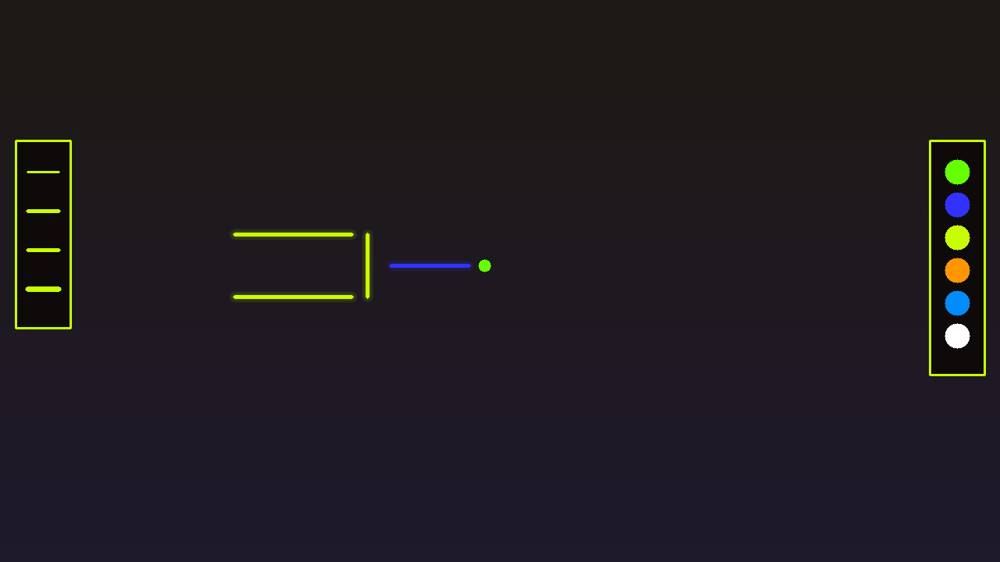
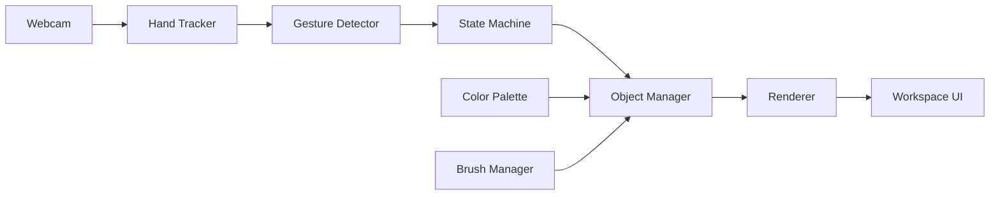

# AirWorkspace / AirScript MVP

An open-source, gesture-controlled AR workspace for Windows. Draw, move, and erase digital ink in the air using nothing but your webcam and one hand.


---

## Demo



> Replace `docs/demo.png` with your own screenshot or screen-recording once you run the app.

---

## Features

- **Gesture-first drawing**
  - ☝️ **Index finger** → draw strokes
  - ✌️ **Index + middle** → navigate without drawing
  - 🤏 **Pinch (thumb + index)** → select and drag objects
  - ✋ **Open palm** → erase strokes or hold to delete an object
- **Mirror-mode webcam** so drawing feels natural, like writing on a mirror.
- **Color palette** (green, red, neon, blue, orange, white) selectable by index-finger hover or number keys `1`–`6`.
- **Brush tools** (Ink, Neon, Marker, Highlighter) with thickness control.
- **Existing drawings keep their style** when you switch colors or brushes.
- **Fullscreen workspace** with futuristic glass-morphism UI panels.
- **Keyboard shortcuts** for colors, brushes, thickness, and quit.
- **Smoke test** and synthetic gesture unit tests included.

---

## Tools & Technologies

| Layer | Tech |
|-------|------|
| Language | Python 3.10+ |
| GUI | PyQt6 |
| Computer Vision | OpenCV |
| Hand Tracking | MediaPipe Hands (Task API) |
| Math / Arrays | NumPy |

---

## System Architecture



### Pipeline

1. **Camera** captures the live feed.
2. **Hand Tracker** (MediaPipe) extracts 21 hand landmarks.
3. **Gesture Detector** classifies `DRAW`, `NAVIGATE`, `PINCH`, or `PALM`.
4. **State Machine** decides whether to draw, select, drag, or erase.
5. **Object Manager** stores finalized stroke objects with their own color, brush, and thickness.
6. **Renderer** draws the mirrored video feed, strokes, UI panels, and cursor.
7. **Workspace UI** displays the fullscreen canvas, color palette, brush selector, and gesture hints.

---

## Project Structure

```
AirWorkspace Project/
├── docs/
│   ├── architecture.md
│   ├── gesture_spec.md
│   ├── requirements.md
│   └── demo.png
├── src/
│   ├── camera/
│   │   └── webcam.py
│   ├── core/
│   │   ├── app_controller.py
│   │   └── state_machine.py
│   ├── drawing/
│   │   ├── smoother.py
│   │   └── stroke.py
│   ├── eraser/
│   │   └── eraser.py
│   ├── models/
│   │   └── hand_landmarker.task
│   ├── objects/
│   │   ├── object_manager.py
│   │   └── stroke_object.py
│   ├── panels/
│   │   └── workspace.py
│   ├── selection/
│   │   └── selection_manager.py
│   ├── tracking/
│   │   ├── gesture_detector.py
│   │   └── hand_tracker.py
│   ├── ui/
│   │   ├── brush.py
│   │   ├── palette.py
│   │   ├── renderer.py
│   │   └── theme.py
│   └── main.py
├── tests/
│   └── test_gesture_detector.py
├── .gitignore
├── ProjectPlan.txt
├── requirements.txt
└── README.md
```

---

## Setup

### 1. Clone the repository

```bash
git clone https://github.com/bot041/Air-Workspace.git
cd Air-Workspace
```

### 2. Create and activate a virtual environment

**Windows (Command Prompt):**

```cmd
python -m venv venv
venv\Scripts\activate
```

**Windows (PowerShell):**

```powershell
python -m venv venv
.\venv\Scripts\Activate.ps1
```

**macOS / Linux:**

```bash
python3 -m venv venv
source venv/bin/activate
```

### 3. Install dependencies

```bash
pip install -r requirements.txt
```

> The MediaPipe hand-landmarker model (`hand_landmarker.task`) is already included in `src/models/`. If you need to re-download it, get it from the [MediaPipe models page](https://developers.google.com/mediapipe/solutions/vision/hand_landmarker).

---

## How to Run

### Normal launch (fullscreen)

```bash
python src/main.py
```

The app opens in fullscreen. Press `Esc` to close.

### Smoke test (runs for 3 seconds and exits)

```bash
python src/main.py --smoke-test
```

### Run gesture unit tests

```bash
python tests/test_gesture_detector.py
```

---

## Controls

### Hand Gestures

| Gesture | Hand Shape | Action |
|---------|------------|--------|
| Draw | Index finger only | Draw strokes |
| Navigate | Index + middle extended | Move without drawing |
| Select / Drag | Pinch (thumb + index) | Select an object, then move while pinching to drag |
| Drop | Release pinch | Drop object |
| Erase | Open palm swipe | Remove touched stroke segments |
| Delete | Open palm hold 1 sec | Delete entire object under cursor |

### Color Palette

- **Index finger hover** over a color swatch for ~0.3 s to select it.
- Or press number keys:
  - `1` Green
  - `2` Red
  - `3` Neon
  - `4` Blue
  - `5` Orange
  - `6` White

### Brush & Thickness

- **Index finger hover** over a brush swatch on the left to select it.
- Or press function keys:
  - `F1` Ink
  - `F2` Neon
  - `F3` Marker
  - `F4` Highlighter
- Adjust thickness:
  - `+` Thicker
  - `-` Thinner

### General

- `Esc` — Quit the app
- `T` — *(removed; use the color palette instead)*

---

## Performance Targets

- 25–30 FPS minimum on a modern laptop with a webcam.
- Hand tracking input resolution: `640x480` for better accuracy at screen edges.

---

## Roadmap / Future Enhancements

- Save / load sessions and export workspace as PNG.
- Undo / redo gestures.
- Two-hand support for zoom / pan / rotate.
- Shape recognition (circles, lines, arrows).
- Sound / haptic feedback and animated transitions.
- Web version or cross-platform packaging with PyInstaller.

---

## License

This project is open-source. Feel free to fork, improve, and share.

---

## Acknowledgements

- [MediaPipe](https://mediapipe.dev/) for the hand-landmark model.
- [OpenCV](https://opencv.org/) and [PyQt6](https://www.riverbankcomputing.com/software/pyqt/) for the video and GUI stack.
